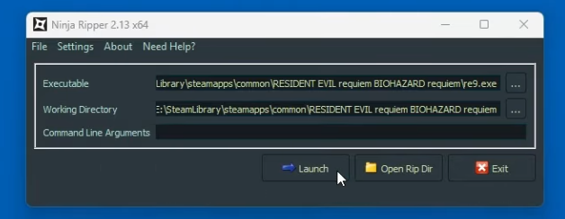

# 🥷 Ninja Ripper v2.13 - Free Download + Tutorial

Welcome to the comprehensive guide on how to use **Ninja Ripper v2.13**. This repository contains a step-by-step tutorial on how to configure, run, and extract 3D assets (meshes, textures, and shaders) from rendering APIs, as well as how to import them into your 3D modeling software.

## ⚠️ Important Legal & Ethical Disclaimer
**Please read before using this tool.**
This tutorial and the Ninja Ripper tool are intended strictly for **educational purposes, legal modding, and personal archiving**. 
* Do not use this tool to extract copyrighted assets from games or software unless you have explicit permission from the creators or hold the rights to the intellectual property. 
* Do not distribute ripped assets. 
* Do not use this tool to bypass anti-cheat systems in multiplayer games, as doing so violates Terms of Service and can result in account bans.
* The authors of this tutorial take no responsibility for how you use this knowledge.

---

## 📑 Table of Contents
1. [Prerequisites](#prerequisites)
2. [Installation](#installation)
3. [Configuration](#configuration)
4. [Ripping the Assets](#ripping-the-assets)
5. [Importing to 3D Software](#importing-to-3d-software)
6. [Troubleshooting](#troubleshooting)
7. [Contributing](#contributing)

---

## 🛠 Prerequisites
Before starting the tutorial, ensure you have the following ready:
* **Ninja Ripper v2.13**: Downloaded and extracted. *(Note: v2.x may require access via the developer's Patreon depending on the specific build).*
* **Target Application**: A legally acquired application or game you wish to analyze.
* **3D Modeling Software**: Blender (v2.8+) or Autodesk 3ds Max.
* **Basic Knowledge**: Familiarity with 3D modeling concepts (meshes, UV maps, textures).

---

## ⚙️ Installation
1. Extract the Ninja Ripper v2.13 archive to a folder on your computer (e.g., `C:\Tools\NinjaRipper`).
2. Make sure you have the necessary Visual C++ Redistributables installed.
3. Locate the `importers` folder inside the Ninja Ripper directory. You will need to install the specific plugin for your 3D software:
   * **Blender**: Install the `.zip` add-on via `Edit > Preferences > Add-ons > Install`.
   * **3ds Max**: Copy the `.ms` (MaxScript) file into your scripts directory and run it.

---

## 🚀 Configuration
Setting up Ninja Ripper correctly is crucial for a successful rip.

1. Open `NinjaRipper.exe` (use the x64 or x86 version matching your target application's architecture).
2. **Target Executable**: Browse and select the `.exe` of the application you want to run.
3. **Arguments**: (Optional) Add any launch arguments required by the application.
4. **Output Directory**: Select where you want the ripped `.nr` (mesh) and `.dds` (texture) files to be saved.
5. **Wrapper / Injection Method**: 
   * Select the appropriate API for your target (e.g., `D3D11`, `D3D12`, `OpenGL`).
   * *Tip: If you are unsure which API the application uses, tools like MSI Afterburner or RTSS can help identify it, or you can try D3D11 as a default starting point.*

---

## 🎮 Ripping the Assets
1. Once configured, click the **Run** button in Ninja Ripper.
2. The target application will launch. Wait until the 3D model you want to examine is rendered on your screen.
3. Use the default hotkeys to trigger the rip:
   * `F10`: Rips all currently loaded models, textures, and shaders in the scene.
   * `F9`: Rips only the specific model/texture currently being drawn (useful to avoid clutter).
   * `F12`: Forces a rip of specific UI elements or textures.
4. The application might freeze for a few seconds to a few minutes. **Do not close it.**
5. Navigate to your Output Directory to confirm the files have been generated.

---

## 📦 Importing to 3D Software

1. Open Blender.
2. Ensure the Ninja Ripper add-on is enabled.
3. Go to `File > Import > Ninja Ripper (.nr)`.
4. Navigate to your Output Directory. 
5. Select the `.nr` files you wish to import.
6. **Import Settings**:
   * Scale: Adjust if the model imports too small/large.
   * UVs: Ensure UV mapping is checked so textures align correctly.
7. Hit **Import**. You can now assign the ripped `.dds` textures to the material nodes of your imported mesh.

---

## ⚠️ Troubleshooting
* **The application crashes on launch:** Try changing the Wrapper/Injection method (e.g., from Intruder to D3D11 Wrapper).
* **Models are imported flat/distorted:** The mesh data might be interleaved differently. Check the advanced import settings in the Blender/Max plugin to adjust the XYZ/UV offsets.
* **No files are generated:** Ensure you are running Ninja Ripper as an Administrator and that your antivirus is not blocking the injection process.
